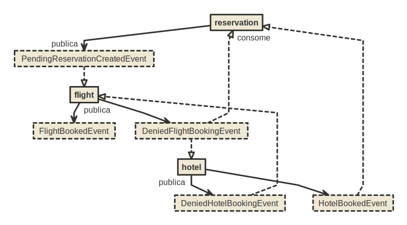

# Descrição
Para demonstrar o uso de [Sagas com Coreografia](https://microservices.io/patterns/data/saga.html), foi criada uma aplicação de exemplos que simula um serviço de reserva de pacotes.

Foram criados 3 serviços:

- `reservation`: responsável por iniciar o processo da reserva e seria a API visível a partir do frontend;
- `flight`: reserva de vôos, o primeiro a ser checado pelo serviço principal;
- `hotel`: reserva de hotéis, invocado após confirmação do vôo. 

Para não deixar a código complicado, os serviços não possuem nenhuma regra de negócio: eles não validam as datas, tipos de quartos existentes e vôos disponíveis. Cada um simplesmente aceitam ou negam uma reserva. Em um ambiente real, deveríamos ter outro serviço responsável por realizar a transação financeira.

## Fluxo de eventos



# Passo-a-passo

1. Iniciar os containers
```sh
docker-compose up -d
```

2. Iniciar o serviço HTTP principal
```sh
docker-compose exec -d reservation composer serve
```

3. Acompanhar os logs do serviço de Vôos
```sh
docker-compose logs -f flight
```

4. Em um segundo terminal, acompanhar os logs do serviço de Hotéis
```sh
docker-compose logs -f hotel
```

5. Em um terceiro terminal, fazer uma nova reserva
```sh
curl -X POST \
  -d "start=2021-12-24&end=2022-01-07" \
  localhost:8080/reservations
```

6. Acompanhar os logs dos serviços confirmando ou negando a reserva
